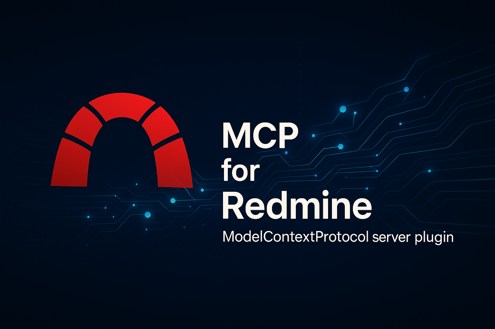

<div align="center">
    
</div>

# MCP-For-Redmine &middot; [](https://github.com/toss/slash/blob/main/LICENSE)

[English](./README.md) | 한국어 | [日本語](./README-ja_jp.md) | [简体中文](./README-zh_cn.md)

이 프로젝트는 Redmine과 상호작용하는 Model-Context-Protocol(MCP) 서버입니다. MCP를 지원하는 클라이언트와 함께라면 Redmine의 프로젝트, 이슈, 사용자, 작업 시간 등을 손쉽게 관리할 수 있습니다.

현재는 표준 입력/출력(`stdio`) 방식만 지원하고 있습니다.

## 사용 요구사항

- Node.js 18 이상 버전
- Redmine API 키 (Redmine 계정의 개인 API 키)

호환 기준: Redmine 6.0.6

## 시작하기

각 개발 환경에서의 MCP 서버 설정 방법:

<details>
<summary><b>Cursor</b></summary>

File(좌측 상단 탭) -> Preferences -> Cursor Settings -> MCP & Integrantions -> New Mcp Server

**설정 파일**: `~/.cursor/mcp.json` (전역) 또는 `.cursor/mcp.json` (프로젝트별)

📚 **참조 문서**: [Cursor MCP 공식 문서](https://docs.cursor.com/en/context/mcp)

[](https://cursor.com/en/install-mcp?name=mcp-for-redmine&config=eyJjb21tYW5kIjoibnB4IC15IEBjaHNwb3dlcjEvbWNwLWZvci1yZWRtaW5lQGxhdGVzdCIsImVudiI6eyJSRURNSU5FX0JBU0VfVVJMIjoiaHR0cHM6Ly95b3VyLnJlZG1pbmUudGxkIiwiUkVETUlORV9BUElfS0VZIjoieW91cl9hcGlfa2V5X2hlcmUifX0%3D)

```json
{
  "mcpServers": {
    "mcp-for-redmine": {
      "command": "npx",
      "args": ["-y", "@chspower1/mcp-for-redmine@latest"],
      "env": {
        "REDMINE_BASE_URL": "https://your.redmine.tld",
        "REDMINE_API_KEY": "your_api_key_here"
      }
    }
  }
}
```

</details>

<details>
<summary><b>Claude Desktop</b></summary>

**설정 파일**:

- **Windows**: `%APPDATA%\Claude\claude_desktop_config.json`
- **macOS**: `~/Library/Application Support/Claude/claude_desktop_config.json`

📚 **참조 문서**: [Claude Desktop MCP 공식 문서](https://support.anthropic.com/en/articles/10949351-getting-started-with-local-mcp-servers-on-claude-desktop)

```json
{
  "mcpServers": {
    "mcp-for-redmine": {
      "command": "npx",
      "args": ["-y", "@chspower1/mcp-for-redmine@latest"],
      "env": {
        "REDMINE_BASE_URL": "https://your.redmine.tld",
        "REDMINE_API_KEY": "your_api_key_here"
      }
    }
  }
}
```

</details>

<details>
<summary><b>Claude Code</b></summary>

📚 **참조 문서**: [Claude Code MCP 공식 문서](https://docs.anthropic.com/en/docs/claude-code/mcp)

**환경변수 설정 후 CLI 명령어**:

```bash
# 환경변수 설정
export REDMINE_BASE_URL=https://your.redmine.tld
export REDMINE_API_KEY=your_api_key_here

# MCP 서버 추가
claude mcp add mcp-for-redmine -- npx -y @chspower1/mcp-for-redmine@latest
```

**또는 설정 파일 직접 편집**: `~/.claude/settings.local.json`

```json
{
  "mcpServers": {
    "mcp-for-redmine": {
      "command": "npx",
      "args": ["-y", "@chspower1/mcp-for-redmine@latest"],
      "env": {
        "REDMINE_BASE_URL": "https://your.redmine.tld",
        "REDMINE_API_KEY": "your_api_key_here"
      }
    }
  }
}
```

</details>

<details>
<summary><b>Gemini CLI</b></summary>

**설정 파일**: `~/.gemini/settings.json` (전역) 또는 `.gemini/settings.json` (프로젝트별)

📚 **참조 문서**: [Gemini CLI MCP 공식 문서](https://gemini-cli.xyz/docs/en/tools/mcp-server)

```json
{
  "mcpServers": {
    "mcp-for-redmine": {
      "command": "npx",
      "args": ["-y", "@chspower1/mcp-for-redmine@latest"],
      "env": {
        "REDMINE_BASE_URL": "https://your.redmine.tld",
        "REDMINE_API_KEY": "your_api_key_here"
      }
    }
  }
}
```

</details>

<details>
<summary><b>OpenAI Codex</b></summary>

**설정 파일**: `~/.codex/config.toml`

📚 **참조 문서**: [OpenAI MCP 공식 문서](https://platform.openai.com/docs/mcp)

```toml
[[mcp_servers]]
name = "mcp-for-redmine"
command = "npx"
args = ["-y", "@chspower1/mcp-for-redmine@latest"]

[mcp_servers.env]
REDMINE_BASE_URL = "https://your.redmine.tld"
REDMINE_API_KEY = "your_api_key_here"
```

</details>

## 설정 옵션

서버는 다음 우선순위에 따라 설정을 읽습니다:

<details>
<summary><b>CLI 인자 (최우선)</b></summary>

- `-u, --url <url>`
- `-k, --api-key <key>`
- ```json
  {
    "mcpServers": {
      "mcp-for-redmine": {
        "command": "npx",
        "args": [
          "-y",
          "@chspower1/mcp-for-redmine@latest",
          "--url",
          "https://your.redmine.tld",
          "--api-key",
          "YOUR_API_KEY"
        ]
      }
    }
  }
  ```

</details>

<details><summary><b>환경변수</b></summary>

- `REDMINE_BASE_URL` 또는 `REDMINE_URL`
- `REDMINE_API_KEY` 또는 `REDMINE_TOKEN`
- `REDMINE_TLS_VERIFY` (선택 사항, TLS 검증을 비활성화하려면 `false` 또는 `0`으로 설정)
- ```json
  {
    "mcpServers": {
      "mcp-for-redmine": {
        "command": "npx",
        "args": ["-y", "@chspower1/mcp-for-redmine@latest"],
        "env": {
          "REDMINE_BASE_URL": "https://your.redmine.tld",
          "REDMINE_API_KEY": "your_api_key_here"
        }
      }
    }
  }
  ```
  </details>

<details><summary><b>.env 파일 값</b></summary>

**지원하는 환경변수:**

- `REDMINE_BASE_URL` 또는 `REDMINE_URL` - Redmine 서버 URL
- `REDMINE_API_KEY` 또는 `REDMINE_TOKEN` - Redmine API 키
- `REDMINE_TLS_VERIFY` - TLS 검증을 비활성화하려면 `false` 또는 `0`으로 설정 (선택 사항)
</details>

## 주요 기능

현재 사용할 수 있는 기능은 다음과 같습니다.

**Stable API**

- **사용자(Users)**: `users_create`, `users_get`, `users_current`, `users_list`, `users_update`, `users_delete`
- **프로젝트(Projects)**: `projects_list`, `projects_get`, `projects_create`, `projects_update`, `projects_archive`, `projects_unarchive`, `projects_delete`
- **이슈(Issues)**: `issues_list`, `issues_get`, `issues_create`, `issues_update`, `issues_delete`
- **작업 시간(Time Entries)**: `time_entries_list`, `time_entries_get`, `time_entries_create`, `time_entries_update`, `time_entries_delete`

**Alpha API**

- **열거값(Enumerations)**: `enumerations_issue_priorities_list`, `enumerations_time_entry_activities_list`
- **프로젝트 멤버십(Memberships)**: `memberships_list_project_memberships`, `memberships_get`, `memberships_create`, `memberships_update`, `memberships_delete`
- **이슈 관계(Issue Relations)**: `issue_relations_list`, `issue_relations_get`, `issue_relations_create`, `issue_relations_delete`
- **버전(Versions)**: `versions_list`, `versions_get`, `versions_create`, `versions_update`, `versions_delete`
- **위키(Wiki Pages)**: `wiki_pages_list`, `wiki_pages_get`, `wiki_pages_create_or_update`, `wiki_pages_delete`
- **쿼리(Queries)**: `queries_list`
- **파일(Files)**: `files_list`
- **첨부(Attachments)**: `attachments_get`, `attachments_delete`, `attachments_upload`
- **이슈 상태(Issue Statuses)**: `issue_statuses_list`
- **트래커(Trackers)**: `trackers_list`
- **역할(Roles)**: `roles_list`, `roles_get`
- **그룹(Groups)**: `groups_list`, `groups_get`, `groups_create`, `groups_update`, `groups_delete`, `groups_add_user`, `groups_remove_user`
- **커스텀 필드(Custom Fields)**: `custom_fields_list`
- **이슈 카테고리(Issue Categories)**: `issue_categories_list`, `issue_categories_get`, `issue_categories_create`, `issue_categories_update`, `issue_categories_delete`
- **내 계정(My Account)**: `my_account_get`
- **검색(Search)**: `search`

각 기능별 상세한 사용법(입력 스키마)은 `src/schema/*.schema.ts` 파일에 정의되어 있습니다. 실행 결과는 JSON 형식의 텍스트로 제공됩니다.

## 공통 입력 규칙 (dev)

- **컬렉션 페이징**: 대부분의 목록 도구는 `offset`, `limit`를 지원합니다 (기본 25, 최대 100)
- **연관 확장**: 일부 `get`/`list` 도구는 `include`를 지원합니다 (예: 이슈 `children,attachments,journals,...`)
- **첨부 업로드 토큰**: `attachments_upload`는 Base64 파일을 `/uploads.json`으로 전송해 토큰을 반환합니다. 이 토큰은 `issues_create/update`나 `wiki_pages_create_or_update` 등의 `uploads` 필드에 사용해 첨부를 연결할 수 있습니다.
- **도구별 확장 필드/제약**: 세부 제약(예: 이슈의 `custom_fields`, `watcher_user_ids` 등)은 각 도구의 스키마(`src/schema/*.schema.ts`)를 참고하세요.

## 문제 해결 가이드

- **설정 오류**
  - **오류 메시지 예시**: `❌ Redmine URL is required!` 또는 `❌ Redmine API key is required!`
  - **해결 방법**: 오류 메시지에 표시되는 여러 설정 방법 중 하나를 선택해서 사용하세요. 보안을 위해 환경변수 사용을 권장합니다.
- **Node.js/ESM 관련 오류**
  - Node.js 18 이상 버전을 사용하고 있는지 확인해주세요.
- **인증 및 네트워크 오류 (401, 403 등)**
  - API 키의 권한과 URL이 올바른지, 네트워크 연결에 문제가 없는지 확인해보세요.
- **Windows 환경에서의 실행 문제**
  - 가이드에 안내된 `cmd /c npx ...` 와 같은 방식으로 실행해보세요.

## 보안 및 권한 안내

- API 키는 민감한 정보이므로, Git 커밋, 로그, 공유 저장소 등에 노출되지 않도록 각별히 주의해주세요.
- 프로젝트나 이슈 삭제와 같이 되돌릴 수 없는 작업을 수행할 때는, 필요한 권한을 가지고 있는지 다시 한번 확인하고 신중하게 실행해주세요.

## 로드맵

베타 엔드포인트(예: 첨부 업로드 흐름)의 심화 지원, SSE(Server-Sent Events) 추가, 예제/테스트 보강을 진행할 예정입니다.

## 라이선스

MIT
